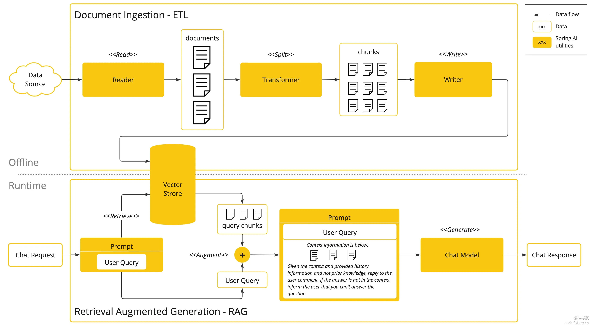
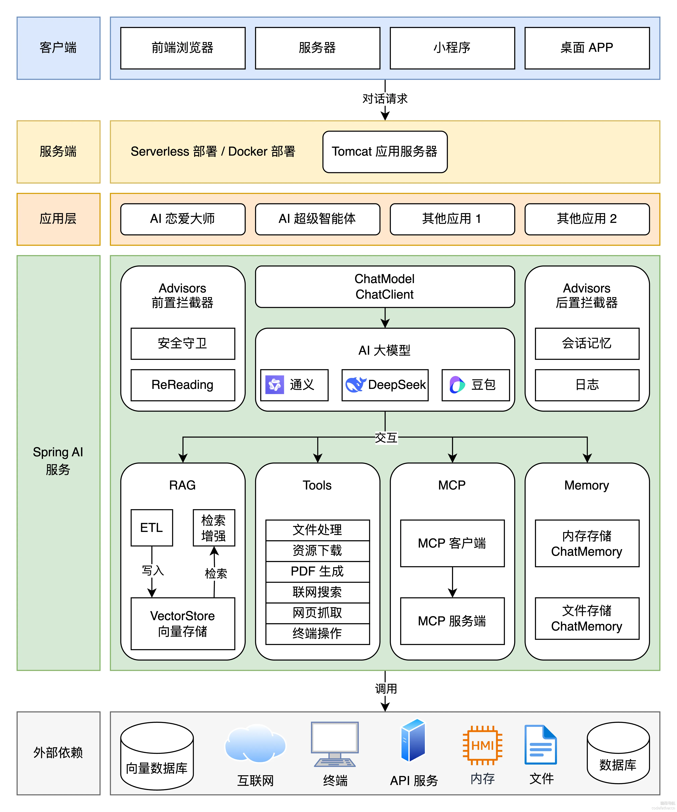

## AI超级智能体项目学习

- AI 应用平台的使用
- 接入 AI 大模型
- AI 开发框架（Spring AI + LangChain4j）
- AI 大模型本地部署
- Prompt 工程和优化技巧
- 多模态特性
- Spring AI 核心特性：如自定义拦截器、上下文持久化、结构化输出
- RAG 知识库和向量数据库
- Tool Calling ️工具调用
- MCP 模型上下文协议和服务开发
- AI 智能体 Manus 原理和自主开发
- AI 服务化和 Serverless 部署

## 技术选型
> 项目以 Spring AI 开发框架实战为核心，涉及到多种主流 AI 客户端和工具库的运用。

- Java 21 + Spring Boot 3 框架
- ⭐️ Spring AI + LangChain4j
- ⭐️ RAG 知识库
- ⭐️ PGvector 向量数据库
- ⭐ Tool Calling ️工具调用
- ⭐️ MCP 模型上下文协议
- ⭐️ ReAct Agent 智能体构建
- ⭐️ Serverless 计算服务
- ⭐️ AI 大模型开发平台百炼
- ⭐️ Cursor AI 代码生成 + MCP
- 第三方接口：如 SearchAPI / Pexels API
- Ollama 大模型部署
- Kryo 高性能序列化
- Jsoup 网页抓取
- iText PDF 生成
- Knife4j 接口文档

## 架构设计
从客户端发送请求开始，自上而下经过一系列处理，最终得到响应结果。架构图如下：
